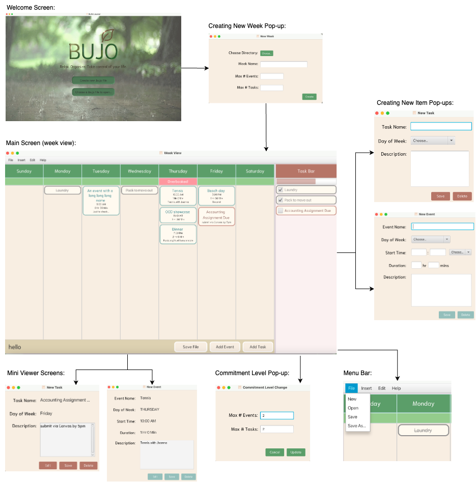

# BUJO The Bullet Journal
### Version 1.1

This is a simple Bullet Journal application. It allows the users to create and edit
.bujo files, where each file holds a summary of a specific week's agenda. 
The app allows creating tasks and events, as well as editing and deleting the items 
already created. The main week view also provides a summary of all tasks within the week 
and a progress bar. The app also allows setting limits on how many tasks and events can be
scheduled within a specific day, notifying the user when they seem to be overbooked. Additionally,
the app implements keyboard shortcuts, hyperlink support in task and event descriptions, and optional
hashed password protection of .bujo files. Finally, the app plays a relaxing background music which
is meant to encourage concentration when journaling, but it may be turned off at any point with a 
keyboard shortcut.

The project was initially completed as a part of CS3500 Object Oriented Design for the final PA05
in the Team "Winston Ate My Bullet Journal" with two other developers: 
[mlow102](https://github.com/mlow102), [totokang](https://github.com/totokang). 
This is a slightly polished version of our group effort, where I was responsible for
the Controller and the View.

## Keyboard Shortcuts:
- `ctrl + s` to save
- `ctrl + n` to create a new week
- `ctrl + e` to create a new event
- `ctrl + t` to create a new task
- `ctrl + o` to open a ".bujo" file
- `ctrl + d` to delete an event or task
- `ctrl + q` to save and quit
- `ctrl + m` to toggle background music on\off

## Jar File
[Jar File](JournalApp.jar)

## Mock Weeks
Mock week file is provided in [mock-weeks](mock-weeks), it can be opened from a welcome screen 
upon app start up. The password is "123".

## SOLID Principles

### Single Responsibility Principle:

This program implements the single-responsibility principle across the design. We segregated
the program into a model, view, and controller, with separate classes to handle individual responsibilities.
For instance, each view has its own controller, which have a high-level controller themselves. In this way,
the program is broken down into individual components that each have a single responsibility.

### Open/Closed Principle:

We have designed our program using a combination of inheritance and composition. This is such that
extending the program is easy and straightforward. For instance, if a new type of calendar item was required,
it could simply extend the Item class such as Event and Task both do. 

### Liskov Substitution Principle:

This program implements the Liskov Substitution Principle by using inheritance correctly.
It is typical in this program to use the Item class as a reference to either an Event or a Task, which
is a fundamental component of this principle. This allows for the program to be extended easily, as
mentioned in the Open/Closed Principle section.

### Interface Segregation Principle:

This program implements the Interface Segregation Principle by using interfaces to define
key functionality. For instance, the Item interface defines the methods that are required for
an item to be displayed in the calendar. This allows for the program to be extended easily, as
mentioned in the Open/Closed Principle section.

### Dependency Inversion Principle:

This program implements the Dependency Inversion Principle, by abstracting the high-level functionality.
For instance, the top level controller primarily delegates responsibility to the lower-level controllers.

## GUI:

[PA Write Up](https://markefontenot.notion.site/PA-05-8263d28a81a7473d8372c6579abd6481)

### Media Attributions:
- [Book Logo](https://icons8.com/icon/l6iocFkbmCrh/book)
- [Welcome Page Background](https://imgur.com/gallery/bVovN)
- [Background music](https://pixabay.com/music/solo-piano-flaing-piano-main-8783/)
